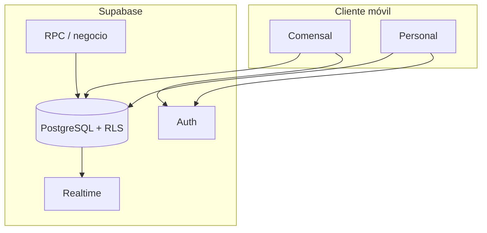

<div align="center">

<pre>
╔═══════════════════════════════════════════════════════════╗
║                        A la Carta                          ║
║         Reservas · menú · cocina · sala · gerencia        ║
╚═══════════════════════════════════════════════════════════╝
</pre>

[](https://www.ipn.mx)
[](https://github.com/AleeSsM/FastTable)

<br />

</div>

Aplicación móvil y web para **operar un restaurante de punta a punta**: el comensal reserva, ordena y consulta su cuenta; el personal atiende mesas, solicitudes y reservas; cocina recibe pedidos y administra la carta; gerencia visualiza indicadores. Todo sobre un backend Supabase propio (PostgreSQL, políticas RLS, funciones RPC y **Realtime** para reflejar cambios sin recargar a mano).

> Este repositorio no comparte ni necesita una base de datos ajena. Cada instalación crea y configura su propio proyecto Supabase con el esquema incluido.

---

## Funciones por rol

| Rol | Capacidades principales |
|-----|-------------------------|
| Comensal | Mesas y reservas, carta, pedidos a cocina, cuenta estimada, fila virtual, solicitudes |
| Sala (mesero / anfitrión) | Reservas a atender, solicitudes, mesas asignadas, control de ocupación |
| Cocina | Cola de pedidos, disponibilidad de platos (centro de control) |
| Gerencia | Indicadores (ingresos, platos, equipo, no disponibles) |

---

## Arquitectura



La **fuente de verdad** es la base de datos; la app solo orquesta permisos y experiencia por rol.

---

## Instalación local

- **Node.js** (LTS) y **npm**
- Un proyecto **Supabase propio**: alojado en Supabase o una instancia local/autohospedada. No basta PostgreSQL genérico, porque la aplicación usa Auth, Storage y Realtime de Supabase.

1. Crea el backend y aplica el esquema completo siguiendo [`supabase/README.md`](supabase/README.md).
2. Crea tu configuración local:

```bash
npm install
cp .env.example .env
# Añade en .env la URL y la clave anónima de TU proyecto Supabase
npm start
```

3. Registra un usuario desde la aplicación. Para crear el primer gerente y el resto del personal, usa `npm run staff:console`; requiere `SUPABASE_SERVICE_ROLE_KEY` únicamente en tu `.env` local.

Para publicar la web, el APK o configurar los enlaces de correo, consulta [`host/README.md`](host/README.md). La guía de producción genérica está en [`docs/PRODUCCION.md`](docs/PRODUCCION.md).

---

## Scripts

| Comando | Descripción |
|---------|-------------|
| `npm start` | Desarrollo (Expo) |
| `npm run staff:console` | Consola local para gestionar fichas de personal |

---

## Base de datos

| Recurso | Contenido |
|---------|-----------|
| [`supabase/README.md`](supabase/README.md) | Guía para crear un backend propio (cloud o local) |
| `supabase/00_schema_teardown.sql` | Borrado de una instalación A la Carta propia (opcional y destructivo) |
| `supabase/01_schema_bootstrap.sql` | Esquema completo, permisos, Storage, Realtime y datos iniciales |

---

<div align="center">

**Instituto Politécnico Nacional** · *La técnica al servicio de la patria*

[](https://www.ipn.mx)

<br />

<sub>A la Carta — documentación del producto. El runtime (Expo / React Native) es el vehículo; el dominio es la operación del restaurante.</sub>

</div>
